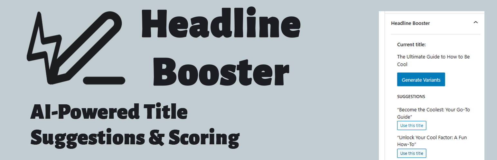
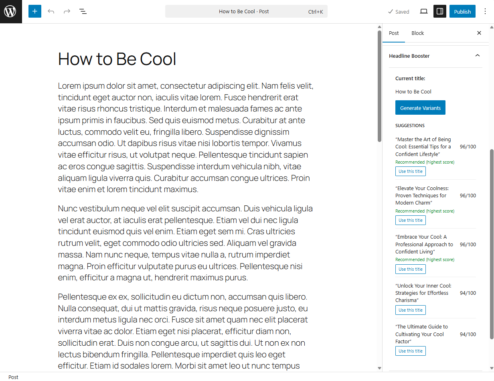
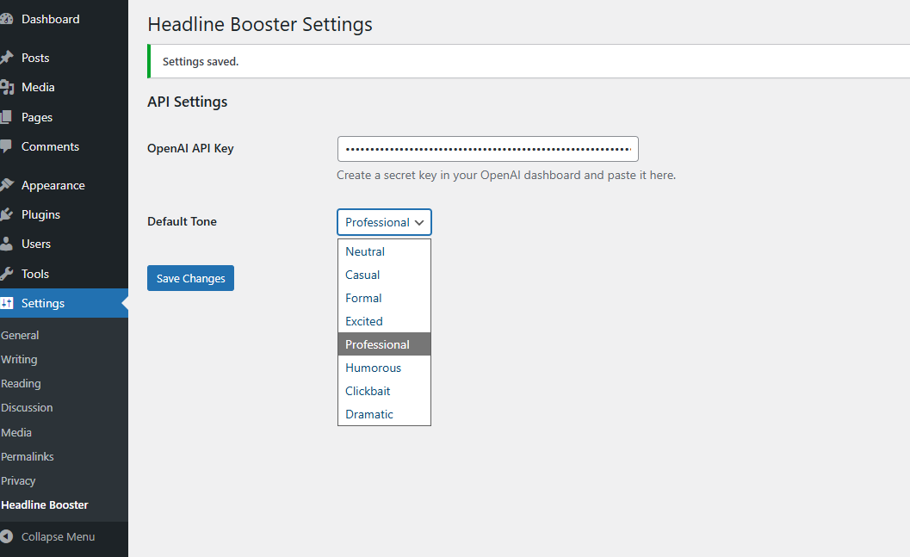

# Headline Booster – AI Title Suggestions  

Generate AI-powered headline variants with scoring directly inside the WordPress block editor.

---

## 🧠 What is Headline Booster?

**Headline Booster** is a WordPress plugin that uses the OpenAI API to generate alternative titles for your posts in real time. It fully integrates into the Gutenberg editor and adds a sidebar panel where you can:

- Generate 3–5 alternative headlines  
- View an automatic **score** (0–100) for each suggestion  
- Instantly apply a chosen title  
- Highlight the best-performing option with *Recommended* badge  

No external tracking, no analytics, no ads — just smarter headline writing.

---

## ✨ Features

- 🔥 **AI-powered headline generation**  
- 📊 **Scoring system** to highlight strong titles  
- 🎨 **Tone selection** (Neutral, Casual, Professional, Dramatic, etc.)  
- 🧩 **Native block editor integration**  
- ⚙️ **Clean settings screen** for managing your API key  
- 🔐 **Privacy-first:** Only post titles/excerpts are sent to OpenAI  
- 🛠️ Zero JavaScript build steps — uses WP-bundled React and `createElement`

---

## 🖼️ Screenshots

### Editor Sidebar Panel

### Settings Page

---

## 🚀 Installation

1. Clone or download the plugin into:

    wp-content/plugins/headline-booster/

2. Activate **Headline Booster – AI Title Suggestions** from **Plugins → Installed Plugins**  
3. Go to **Settings → Headline Booster** and enter your OpenAI API key  
4. Edit a post → open the *Headline Booster* sidebar → click **Generate Variants**

---

## 🔧 Developer Notes

The plugin uses:

- **PHP 7.4+**
- **WordPress REST API**
- **OpenAI Chat Completions API**
- **wp.element**, **wp.components**, **wp.data**, **wp.plugins**
- `wp_remote_post` for secure server-side requests
- No JSX build step — pure `createElement()` rendering

## Changelog

- 1.0.4
Plugin check compliance and text domain alignment for wp.org slug

- 1.0.0
Initial release.

### Key Files

- `headline-booster.php` — plugin bootstrap & asset loading  
- `includes/class-hb-settings.php` — settings page  
- `includes/class-hb-rest.php` — REST endpoints  
- `includes/class-hb-ai-client.php` — OpenAI API wrapper  
- `assets/js/editor-sidebar.js` — Gutenberg panel & scoring  

---

## 🔐 Privacy

Only the post title and optional excerpt are sent to the OpenAI API.  
The plugin stores **only** your API key in WordPress options.

---

## 📝 License

GPLv3 or later.  
Pull requests welcome!

---

## 👨‍💻 Author

Created by **Aaron Campbell**  
<https://campbellaaron.github.io>

